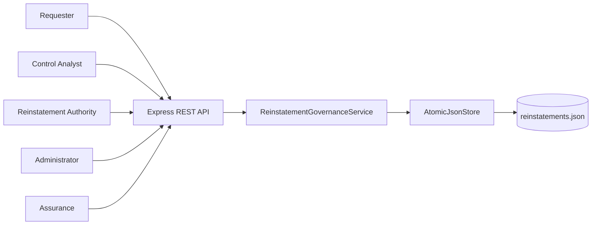
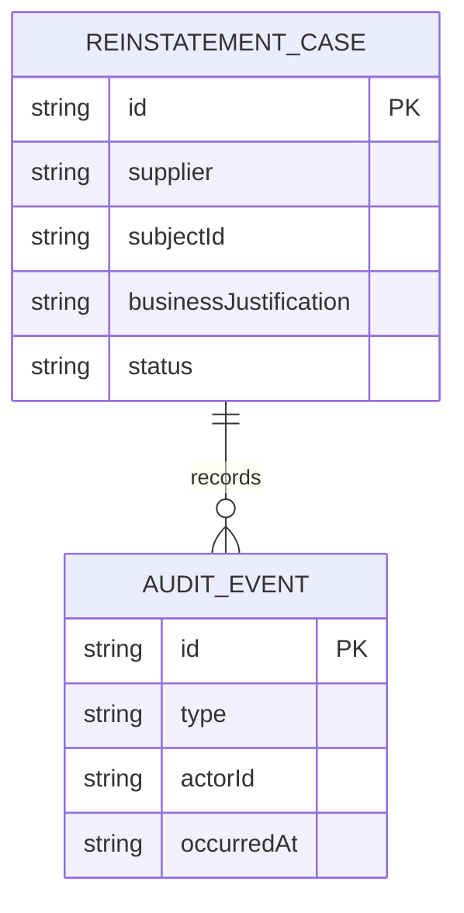
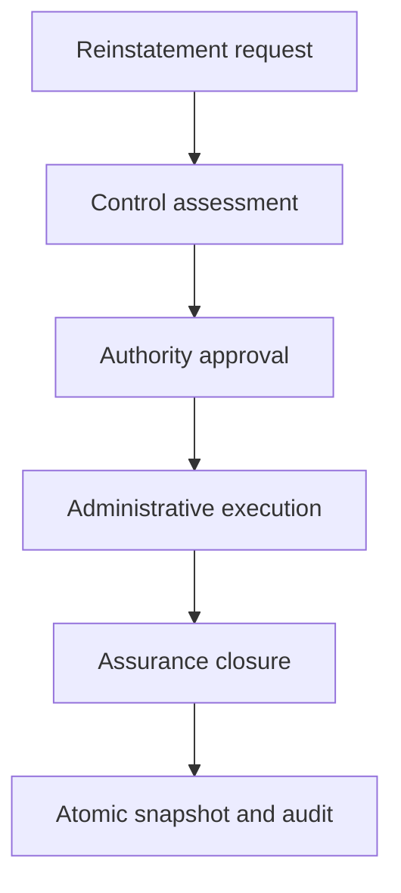
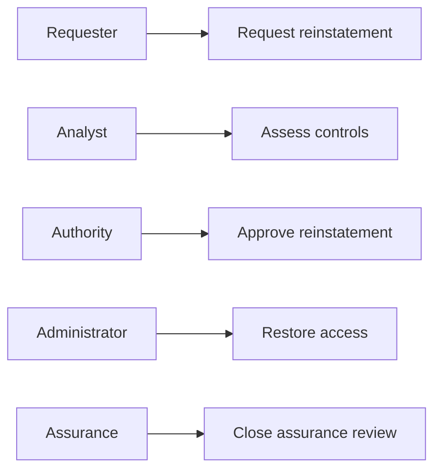
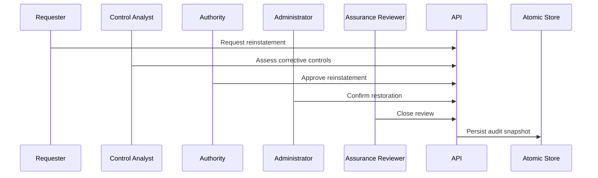

# Supplier Evidence Access Reinstatement Governance Platform

## The Problem

Supplier evidence access must not be restored simply because a prior suspension ended. Teams need a controlled record that confirms the business justification, evaluates corrective controls, documents approval, proves the technical reinstatement, and captures independent assurance.

## The Solution

This service governs reinstatement cases through request, control assessment, authority approval, administrator execution, and assurance closure. Each transition is role-gated, state-gated, audited, and persisted atomically.

## Live Demo and Tech Stack

Use `http://localhost:62300/health` after starting the service. The stack uses Node.js 22, Express 5, ESM JavaScript, atomic JSON persistence, Vitest, and GitHub Actions.

| Layer | Implementation | Responsibility |
| --- | --- | --- |
| API | Express 5 | REST routes and structured error responses |
| Domain | ESM JavaScript | Reinstatement lifecycle and role controls |
| Storage | Node file system | Temporary writes followed by atomic rename |
| Testing | Vitest | Six success and blocked-action tests |

## Local Setup and Run Instructions

```bash
git clone https://github.com/kholipha-ahmmad-al-amin/supplier-evidence-access-reinstatement-governance-platform.git
cd supplier-evidence-access-reinstatement-governance-platform
npm install
npm test
npm start
```

The service binds to `0.0.0.0:62300` for approved LAN use.

## System Documentation

### System Architecture Diagram


### Entity-Relationship Diagram


### Data Flow Diagram


### Use Case Diagram


### Sequence Diagram


## Owner

Created and maintained by Kholipha Ahmmad Al-Amin.

Software Engineer and AI Specialist

Founder and CEO of EquiSaaS BD

Principal Consultant at AR IT Consultancy

Full Stack Developer and SaaS Product Builder

### Official links

Portfolio: https://kholipha-ahmmad-al-amin.equisaas-bd.com/

GitHub: https://github.com/kholipha-ahmmad-al-amin

LinkedIn: https://www.linkedin.com/in/kholipha-ahmmad-al-amin

X: https://x.com/al_amin5519

Facebook: https://www.facebook.com/kholipha.ahmmad.al.amin

Instagram: https://www.instagram.com/kholipha.ahmmad.al.amin

## Ownership

This project was created and is maintained by Kholipha Ahmmad Al-Amin.
